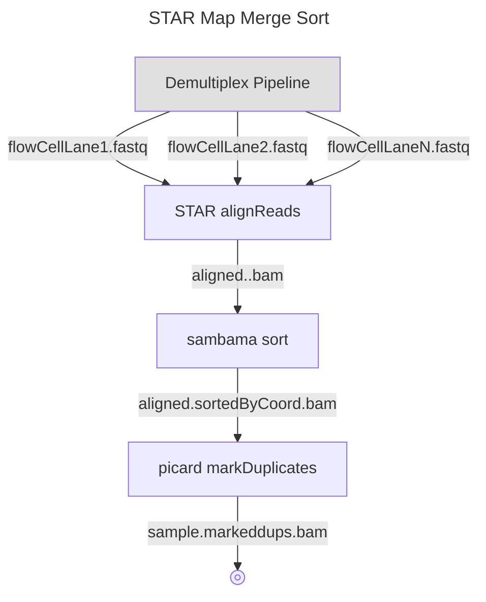
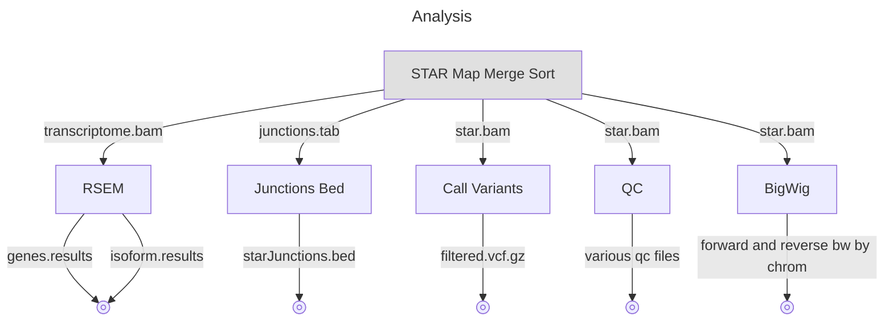
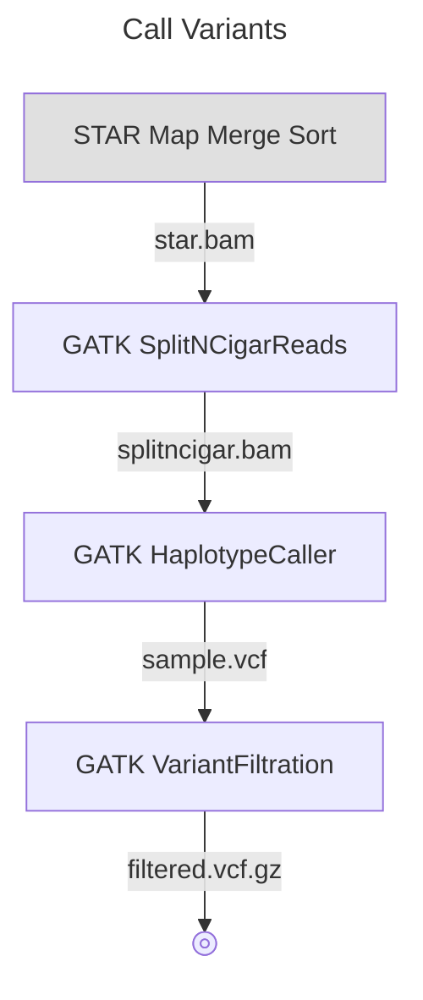
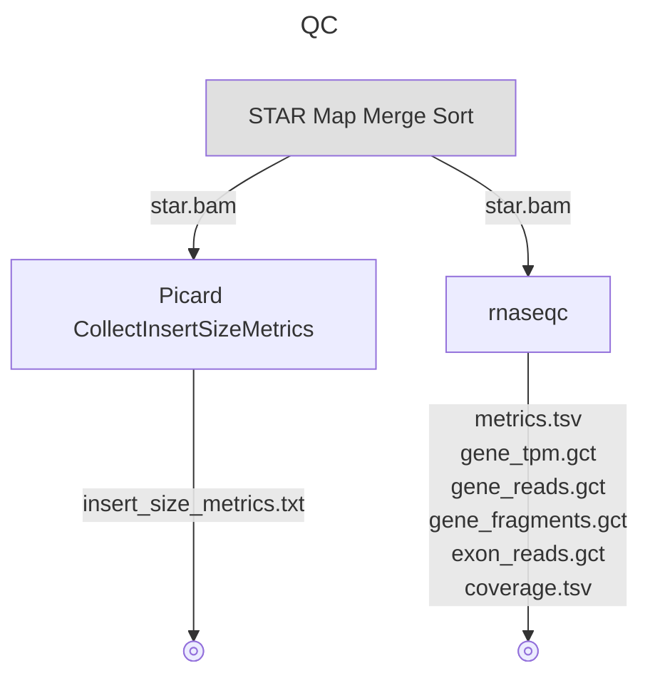

# nwgc-nf-shortread-rna-seq

Contact: nwgc-software@uw.edu

----

## Introduction

nwgc-nf-shortread-rna-seq is a nextflow pipeline for aligning and analyizig short read rna seq data.  The pipeline takes fastq files as input.

nwgc-nf-shortread-rna-seq uses NWGC modules as its main computing environment.  However, it could easily be adapted to use containers by creating containers corresponding to the NWGC modules.

## Contents

* [Introduction](#introduction)
* [Latest Updates](#latest-updates)
* [Usage](#usage)
* [Configuration](#configuration)

## Latest Updates

*v1.0.0 (April 15, 2024)*: Initial Release

## Usage

    The typical command for running the pipeline is as follows:
    
      nextflow run main.nf 
        -params-file SAMPLE_YAML
        -profile PROFILES
        -w WORKING_DIR
        -N USER_EMAIL
        -resume
        -name JOB_NAME

    Mandatory arguments:
      --params-file SAMPLE_YAML    Path to YAML file with sample information (see example-config.yaml in git repository)
      --profile PROFILES           Comma separated list of profiles that specify which instanceSize, executor and environment profiles to use.
                                   See PROFILES section below for details.
    
    Optional arguments:
      -w WORKING_DIR               Path to a directory to store all the work in (default is "work" in directory where pipeline is run
      -N USER_EMAIL                Your email address if you want an email when the pipeline finishes
      -resume                      Include this if you want to resume a pipeline that failed part way through
      -name JOB_NAME               If you want your pipeline to have a specific name (good for qsubbed pipelines)
    
    PROFILES
      You should specify 3 different types of profiles instanceSize, executor and environment.  A * below designates the most commonly used 
      profiles in our environment
      
      instanceSize
        instanceSizeHigh *          High memory, multiple cpus
        instanceSizeLow             Minimal memory and cpus, (Used for testing mostly)
         
      executor
        executorGridEngine *        Defines grid cluster options (project, runtime guestimates, etc.)
        executorLocal               This is used for testing on your local machine
         
      environment
        environmentUbuntu22 *       Defines modules in the NWGC Ubuntu environment
        ~environmentCentOS7          Defines modules in the NWGC CentOS environment (DEPRECATED)~
        environmentContainer        Defines container(s) to use that have software preloaded (Currently not implemented)

## Configuration

The main configuration of the pipeline is done through a sample.yaml file.  The example-config.yaml file shows all the mandatory configuration parameters that should be supplied.  The following is a more detailed explanation of each of the parameters needed.

### User
*userId*  
The user id is used as part of the tag for nextflow modules.  The tag is also used as the job name when running on a cluster.  
(nextflow_tag:  \<module name>\_\<sample id>\_\<user id>)

*userEmail*  
This email address is used by nextflow to sends out emails upon workflow completion and/or errors.

### Sample
*sampleId*  
The sample id is used  as a prefix for some output files and as part of the tag for the nextflow modules.

*samplesDirectory*  
The sample directory is used as the publish location for all output files.

*organism*  
The organism of the sample.  This is used in the BigWig step in order to determine what types of bigwig files to create.  If the organism is 'homo sapians' the bigwigs will be created for each chromosome, otherwise only one bigwig will be created for the entire genome.

# STAR
*starDirectory*  
The directory location of the STAR bundle reference files. This is need by STAR and some of the analysis steps. It is also the location where the below reference files should be located.

*referenceGenome*  
The name of the reference genome file located in *starDirectory*.

*rsemReferencePrefix*    
Prefix of RSEM specifc file that are in the *starDirectory*.

*gtfFile*  
The name of the the genocde GTF file located in *starDirectory*.

*effectiveGenomeSize*    
The number of bases in the genome reference.  Needed for BigWig.

### Standard Input  - Flow Cell Lane Libraries
*flowCellLaneLibraries*  
Flow cell lane and fastqs info for fastq inputs.

*flowCellLaneLibraries.flowCell*  
The name of the flow cell.

*flowCellLaneLibraries.lane*  
The lane number of the flow cell.

*flowCellLaneLibraries.library*  
The library id.

*flowCellLaneLibraries.fastq1*  
Path to the fastq1 file.

*flowCellLaneLibraries.fastq2*  
Path to the fastq2 file.

*flowCellLaneLibraries.runDate*  
The run datee of the flow cell.

*flowCellLaneLibraries.sequencingPlatform*  
The sequencing platform of the flow cell (Illumina,Element)

### Input - Analysis Only  
Files to specify if STAR has already been run and only analysis steps are to be performed.  These should only be used if the *stepsToRun* parameter is set to "Analysis".  Also the specific analysis steps to run can be set in the *customAnalysisToRun* parameters.

*analysisStarBam* (VCF, QC, and/or BigWig)  
The main bam file produced by STAR.

*analysisTranscriptomeBam* (RSEM)  
The transcriptome bam file produced by STAR.

*analysisSpliceJunctionsTab* (Junctions)  
The splicejunctions.tab file produced by STAR.

### Optional Params  
*stepsToRun*  
Normal processing will run all 3 main steps in the pipeline: FastxQC, STAR, and Analysis.  If there is a need to run specifc steps only then this parameter can be added to the yaml file.

*customAnalysisToRun*  
Normal processing will run all 5 analysis steps: RSEM, Junctions, VCF, QC, and BigWig.  If there is a need to run specifc analysis steps only then this parameter can be added to the yaml file.

### Modules  
The modules used for the steps are specified in /config/profiles/environment/environmentUbuntu22.config file.

