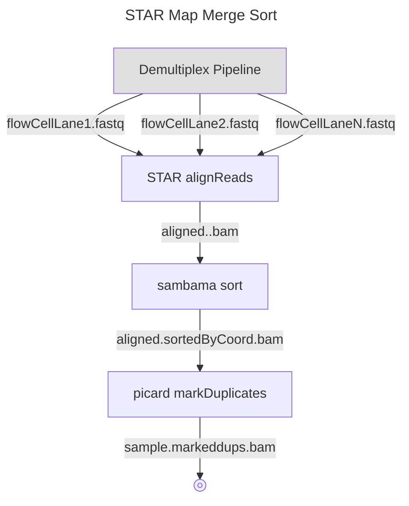
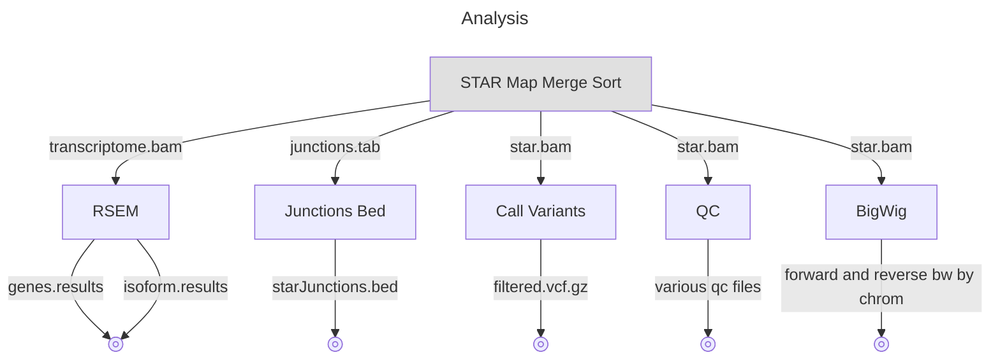
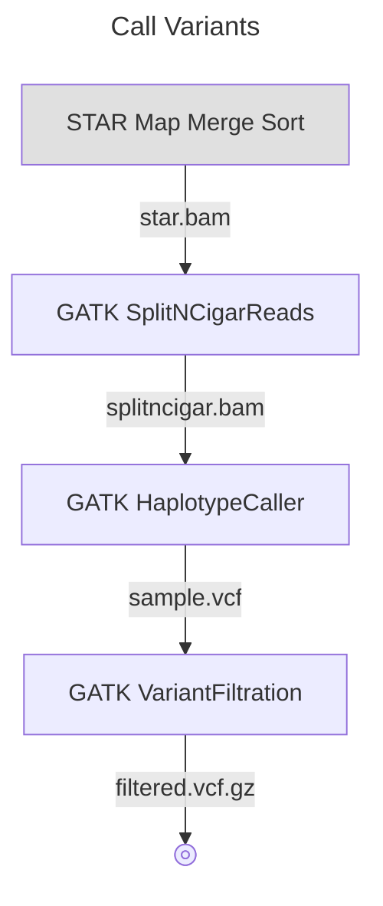
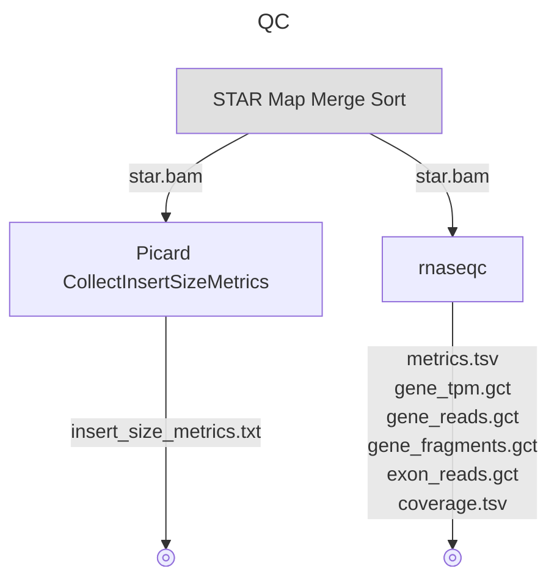

# nwgc-nf-shortread-rna-seq

Contact: nwgc-software@uw.edu

----

## Introduction

```mermaid
---
title: STAR Map Merge Sort
---
flowchart TD
    A["Demultiplex Pipeline"] -- "flowCellLane1.fastq" --> B
    A -- "flowCellLane2.fastq" --> B
    A -- "flowCellLaneN.fastq" --> B 
    style A fill:#E0E0E0
    B["STAR alignReads"] -- "aligned..bam" --> C
    C["sambama sort"] -- "aligned.sortedByCoord.bam" --> D
    D["picard markDuplicates"] -- "sample.markeddups.bam" --> n1@{ shape: fr-circ}
```

```mermaid
---
title: Analysis
---
flowchart TD
    A["STAR Map Merge Sort"] -- "transcriptome.bam" --> B
    style A fill:#E0E0E0
    B["RSEM"] -- "genes.results" -->  n1@{ shape: fr-circ}
    B -- "isoform.results" -->  n1@{ shape: fr-circ}
    A -- "junctions.tab" --> C
    C["Junctions Bed"] -- "starJunctions.bed" --> n2@{ shape: fr-circ}
    A -- "star.bam" --> D
    D["Call Variants"]  -- "filtered.vcf.gz" --> n3@{ shape: fr-circ}
    A -- "star.bam" --> E
    E["QC"]  -- "various qc files" --> n4@{ shape: fr-circ}
    A -- "star.bam" --> F
    F["BigWig"]  -- "forward and reverse bw by chrom" --> n5@{ shape: fr-circ}
```

```mermaid
---
title: Call Variants
---
flowchart TD
    A["STAR Map Merge Sort"] -- "star.bam" --> B
    style A fill:#E0E0E0
    B["GATK SplitNCigarReads"] -- "splitncigar.bam" -->  C
    C["GATK HaplotypeCaller"] -- "sample.vcf" --> D
    D["GATK VariantFiltration"]  -- "filtered.vcf.gz" --> n1@{ shape: fr-circ}
```

```mermaid
---
title: QC
---
flowchart TD
    A["STAR Map Merge Sort"] -- "star.bam" --> B
    style A fill:#E0E0E0
    B["Picard CollectInsertSizeMetrics"] -- "insert_size_metrics.txt" -->  n1@{ shape: fr-circ}
    A -- "star.bam" --> C
    C["rnaseqc"] -- "metrics.tsv<BR>gene_tpm.gct<BR>gene_reads.gct<BR>gene_fragments.gct<BR>exon_reads.gct<BR>coverage.tsv" --> n2@{ shape: fr-circ}
```

